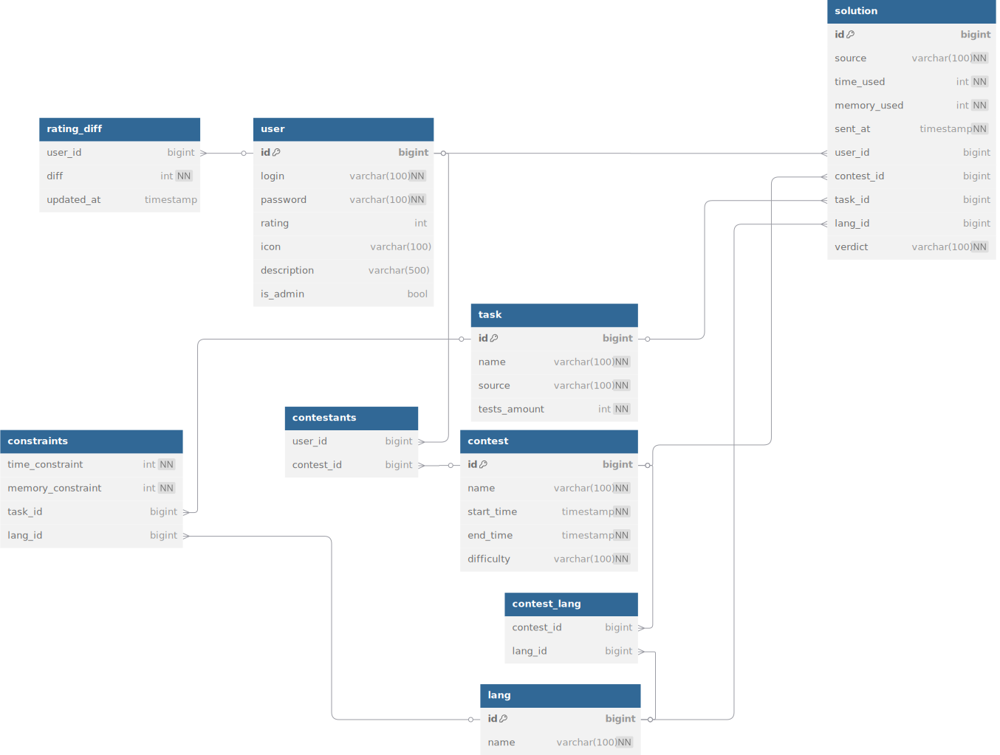
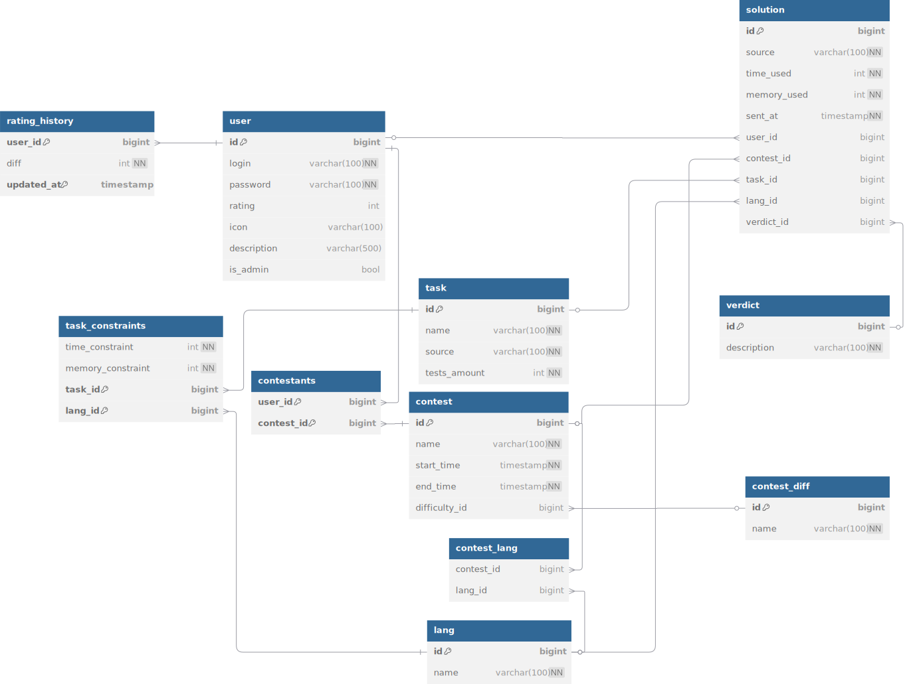
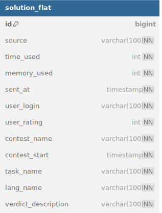

# Пояснительная записка
### Назначение разрабатываемой системы
Разрабатываемая система предполагает использование
для хранения всех необходимых данных для работы проверяющих систем
по спортивному программированию, подобных codeforces и Яндекс контест.

---
### Функциональные требования
Основными сущностями в данной системе являются участник (или пользователь),
соревнования (контесты), решения и задачи. \
Пользователь (Участник):
1) Возможность регистрации и аутентификации пользователей.
2) Хранение данных: уникальный идентификатор, логин, хэш пароля, рейтинг, ссылка на аватар, описание профиля, статус администратора.
3) Возможность администратора добавлять/редактировать контесты.

Контест (Соревнование):
1) Хранение данных: уникальный идентификатор, название, дата и время начала, дата и время окончания, уровень сложности (например, аналогично div на Codeforces), разрешенные языки для сдачи.
2) Возможность привязки задач к контесту.
3) Возможность просмотра информации о контесте и его участниках.

Задача:
1) Хранение данных: уникальный идентификатор, название, путь к каталогу с условиями, количество тестов, ограничение по времени и памяти отдельно для каждого ЯП. 
2) Привязка к контестам.
3) Возможность получения информации о задаче и связанных посылках.

Посылка (Решение):
1) Хранение данных: уникальный идентификатор, путь к исходному коду, использованное время и память, время отправки, идентификаторы связанного пользователя, задачи, контеста и языка программирования, а также вердикт проверки.

Необходимые запросы:
1) Возможность получить все соревнования, в которых участвует пользователь.
2) Получение количества очков, требуемого для получения призового места в контесте (Первые 25% участников).

---
### Нефункциональные требования
1) БД должна гарантировать целостность ссылок FK между всеми таблицами
2) Все временные поля должны храниться в едином формате для избегания ошибок при участии в соревнованиях
3) БД должна позволять создавать контесты только пользователям с правами администратора
4) Пароли должны храниться в виде хэшей.
---
### Предварительная схема

---
### Ограничения
1) У каждого контеста должен быть как минимум один поддерживаемый язык программирования
2) У каждой посылки затраты не могут превышать затраты, указанные в таблице constraints.
3) Любая задача должна присутствовать как минимум в одном контесте
4) Пользователь может принять участие в контесте только 1 раз
5) Каждая задача должна иметь как минимум 1 тест
6) Посылки могут отправляться только участниками контеста, в котором есть данная задача
7) Начало контеста должно происходить раньше его конца
8) Рейтинг не может быть отрицательным
9) Удаление пользователя должно каскадно удалять его посылки и участия в контестах
---

### Нормализованная форма

---
### Пример аномалий
Рассмотрим следующую таблицу: \
 \
Данная таблица позволяет хранить все данные необходимые для данных требований.
Допустим, пользователь обновил свой логин. В данном случае потребуется обновить все посылки данного пользователя, чего бы не произошло в случае
с нормализованной таблицей. В случае удаления всех посылок пользователя, информация с его логином и рейтингом пропадёт, чего не должно происходить.
В случае, если пользователь только создал аккаунт, в базе данных не будет информации о его логине, и придётся создавать фиктивную запись в данную таблицу.

### Дополнительно
В файле `init/procedures.sql` находятся процедуры, которые удовлетворяют требованиям. Из дополнительного, реализована процедура
расчёта рейтинга всех участников контеста (её можно например запускать как cron job).
В файле `init/triggers.sql` находятся триггеры, которые удовлетворяют ограничениям.

### Участники проекта
Щепеткин Илья, БПИ232
Городецкий Егор, БПИ232